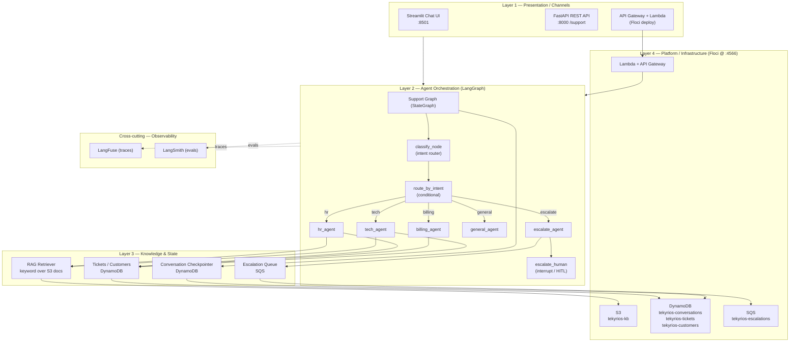
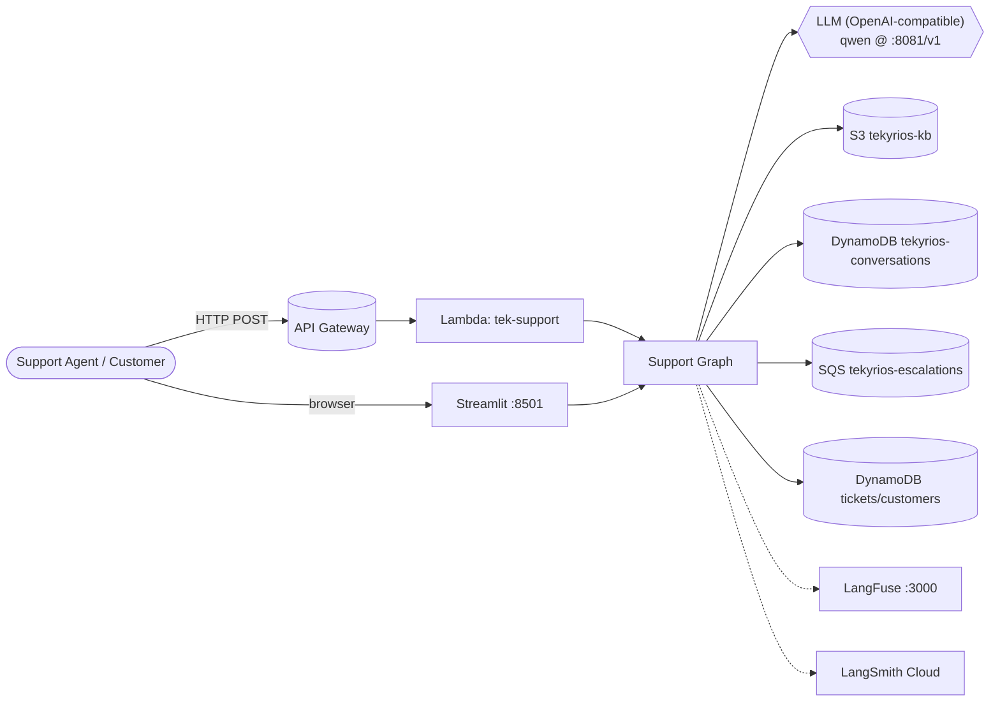
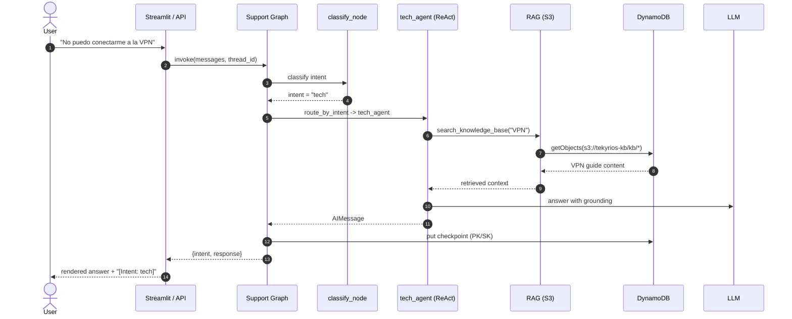
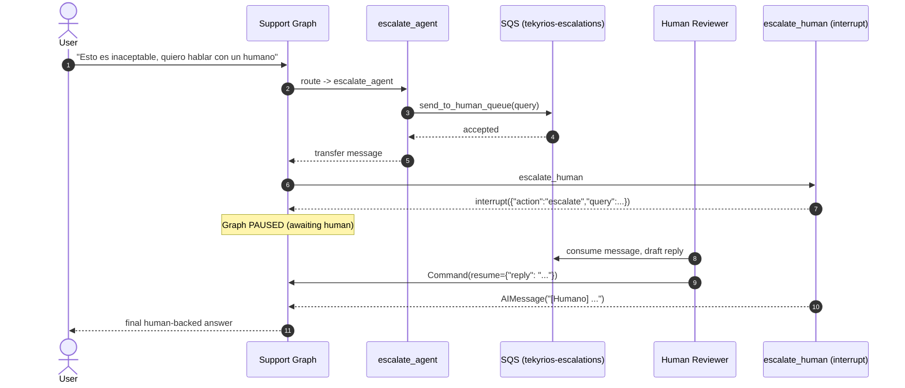
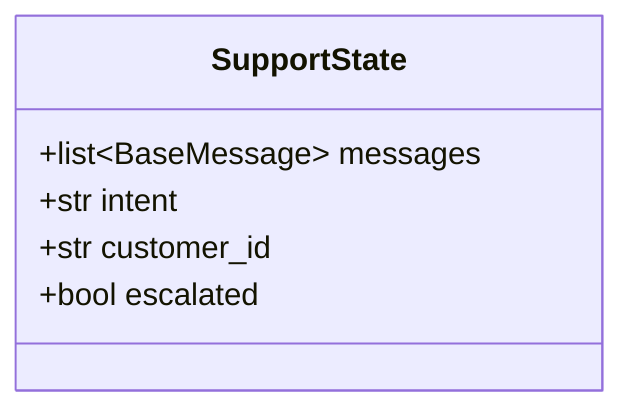
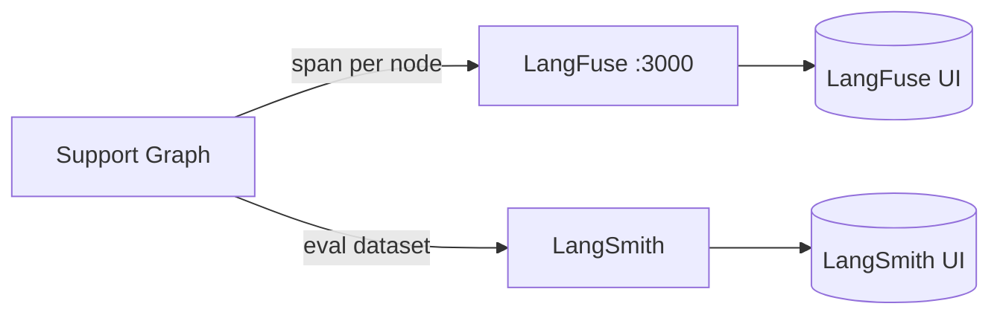

# Tekyrios AI Support — Architecture

> Multi-agent customer-support assistant for **Tekyrios SAS**, built with
> **LangGraph** (orchestration), **LangFuse** + **LangSmith** (observability),
> and **Floci** (a local AWS emulator providing S3 / DynamoDB / SQS / Lambda).

All diagrams in this document are written in **Mermaid** so they render on
GitHub, in VS Code, and in any Markdown viewer.

---

## 1. System Overview

Tekyrios AI Support routes an incoming support message through a LangGraph
state graph. A classifier node detects the customer intent (`tech`, `billing`,
`hr`, `escalate`, `general`) and a conditional router dispatches the request to
the matching specialist ReAct agent. Specialists consult a Retrieval-Augmented
Generation (RAG) knowledge base stored in S3 and can create tickets / inspect
customer state in DynamoDB. When a case exceeds automation, an escalation agent
publishes the query to an SQS queue and the graph pauses via a LangGraph
`interrupt` for Human-in-the-Loop (HITL) review.

All AWS services run locally inside **Floci** (`http://localhost:4566`), so the
whole stack is reproducible without a cloud account. An OpenAI-compatible LLM
endpoint (e.g. a local `qwen` model served at `http://192.168.1.10:8081/v1`) is
used through `langchain-openai`.

---

## 2. Four-Layer Architecture

The system is decomposed into four logical layers. Cross-cutting observability
(LangFuse + LangSmith) instruments every layer.



### Layer responsibilities

| Layer | Responsibility | Key components |
|-------|----------------|----------------|
| **1. Presentation** | Capture user input and render agent answers across channels. | Streamlit UI, FastAPI `/support`, API Gateway + Lambda |
| **2. Orchestration** | Classify intent, route, run specialist ReAct agents, handle HITL. | LangGraph `SupportState` graph, classifier, 5 specialist nodes |
| **3. Knowledge & State** | Provide grounded answers (RAG), persist conversations, queue escalations. | S3 RAG retriever, DynamoDB checkpointer, SQS escalation |
| **4. Platform** | Emulated AWS services backing the whole stack locally. | Floci: S3, DynamoDB, SQS, Lambda |

---

## 3. Component & Deployment Diagram



---

## 4. UML Sequence Diagrams

### 4.1 Standard support flow (technical intent)



### 4.2 Human escalation flow (HITL)



---

## 5. State Model

The graph uses a `MessagesState` extension:



- `intent` — set by `classify_node`; one of `tech|billing|hr|escalate|general`.
- `customer_id` — passed by the channel; used by tools to look up state.
- `escalated` — set `True` once the human flow resolves.

---

## 6. Data Stores

| Store | Name | Schema | Purpose |
|-------|------|--------|---------|
| S3 | `tekyrios-kb` (`/kb/*`) | object blobs (`.md`) | RAG knowledge base |
| DynamoDB | `tekyrios-conversations` | `PK` (HASH, S), `SK` (RANGE, S) | LangGraph checkpointer (single-table, `langgraph-checkpoint-aws`) |
| DynamoDB | `tekyrios-tickets` | `ticket_id` (HASH) | Support tickets created by agents |
| DynamoDB | `tekyrios-customers` | `customer_id` (HASH) | Customer account status |
| SQS | `tekyrios-escalations` | queue | Pending human reviews |

> Note: `tekyrios-tickets` and `tekyrios-customers` are created on first write
> by the agent tools. `tekyrios-conversations` is provisioned by `floci/init.sh`.

---

## 7. Observability



- **LangFuse** captures per-node traces (classify, each agent, RAG retrieval)
  for live debugging. Self-hosted via `docker compose up -d` → `http://localhost:3000`.
- **LangSmith** is used for evaluation datasets / LLM-as-judge correctness of
  intent classification. Tracing is enabled only when a valid `LANGSMITH_API_KEY`
  is present in `.env`.

---

## 8. Technology Stack

| Concern | Technology |
|---------|------------|
| Orchestration | LangGraph 1.x (`StateGraph`, `create_react_agent`, `interrupt`) |
| Agents | `langchain-openai` `ChatOpenAI` (ReAct) |
| LLM | OpenAI-compatible endpoint (local `qwen3.8-27b` at `:8081/v1`) |
| Persistence | `langgraph-checkpoint-aws` DynamoDBSaver (Floci) |
| RAG | S3 documents + keyword retrieval (Bedrock+OpenSearch roadmap) |
| Messaging | SQS (escalation queue) |
| Observability | LangFuse, LangSmith |
| Local cloud | Floci (`localhost:4566`) |
| API | FastAPI + Uvicorn, deployed as Lambda |
| UI | Streamlit |
| Packaging | Python venv, `requirements.txt`, `docker-compose.yml` |
```
